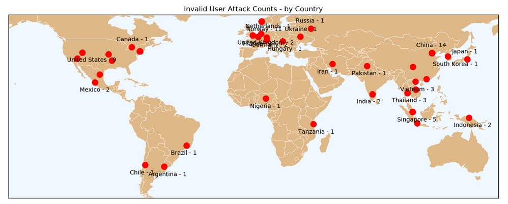

## bot-attacks: Server Bot Attack Visualization

This notebook visualizes bot (Invalid user) attacks using an anonymized server log and IP address geolocation.  Bot
data is extracted from the log, geolocated with ipinfo, and put in a pandas dataframe.  Bot data is visualized
using histograms and a network graphs.  

Dataframe is archived to postgreSQL table linuxlog.  linuxlog is queried for Singapore and results saved to
singapore_df dataframe.

For this sample of 72 bots--logged 28 April, 2019--one-third of the bots are from China and Norway.
***
  **Bot attack geographic locations:**    

***
  **A few of the countries linked to their respective bot usernames:**    

***
  **Query postgreSQL table for Singapore:**

***
