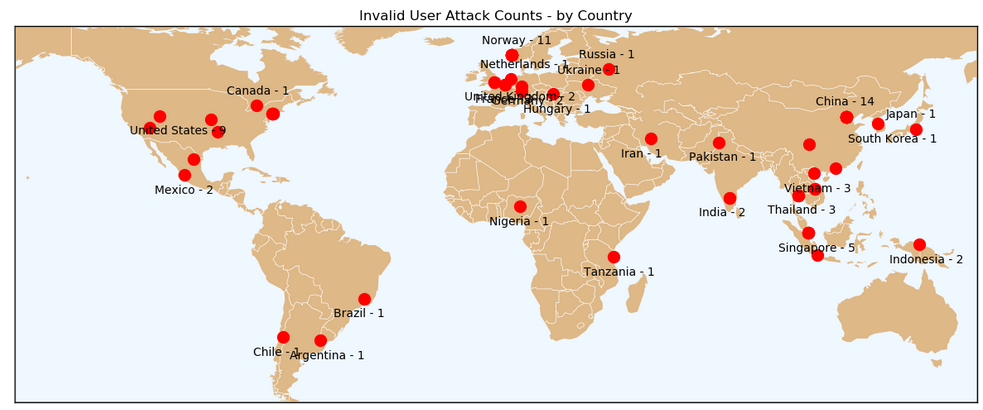
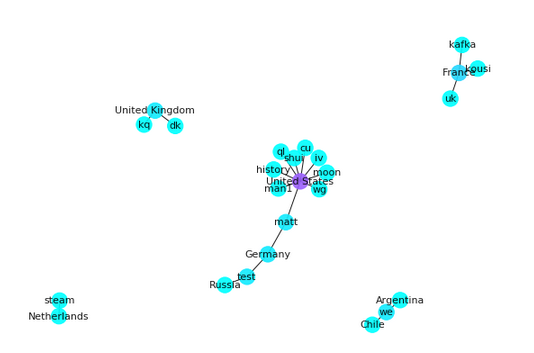
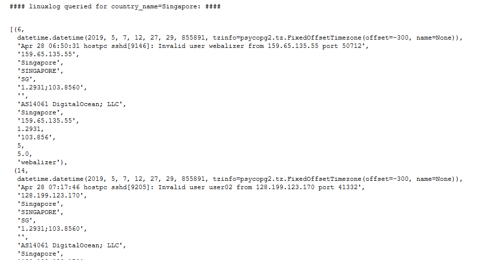

## bot-attacks: Server Bot Attack Visualization

The internet is a *cesspool* of spy bots.  Bots can attack an internet server hundreds of times a day.  This Jupyter notebook visualizes bot attacks using my anonymized server log and IP address geolocation.

Bot data is extracted from the log, geolocated with ipinfo, and put in a pandas dataframe.  Data is visualized with histograms and a network graphs using the dataframe we built.

For this sample of 72 bots -- logged on 28 April, 2019 -- one-third of the bots are from China and Norway.  The sample size can be raised because the log captures over 1,500 bot attacks in four days.  However, the earth map must be enhanced to be legible for larger samples.

Moving data between pandas and a postgreSQL database is illustrated as follows.  First, the dataframe is archived to a postgreSQL table called linuxlog.  Next, linuxlog is queried for Singapore.  The results are copied to another dataframe.
***
**Bot attack geographic locations:**

*Note:  If there are multiple IPs in a country, the IP locations are plotted as red circles.  However, countries are only labeled once.*
***
**A few of the countries linked to their respective bot usernames:**

***
**Query postgreSQL table for Singapore:**

***
